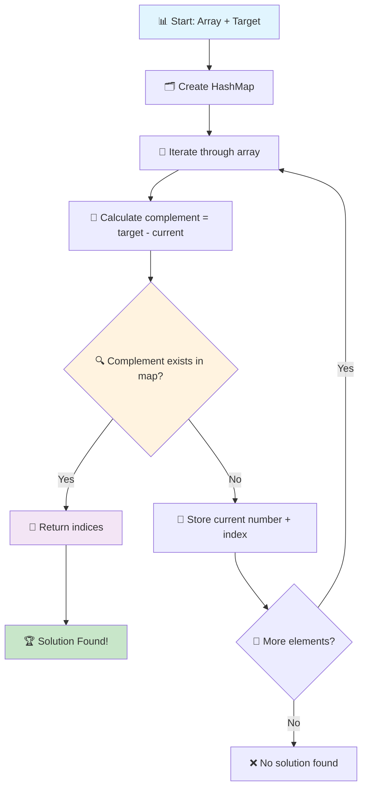
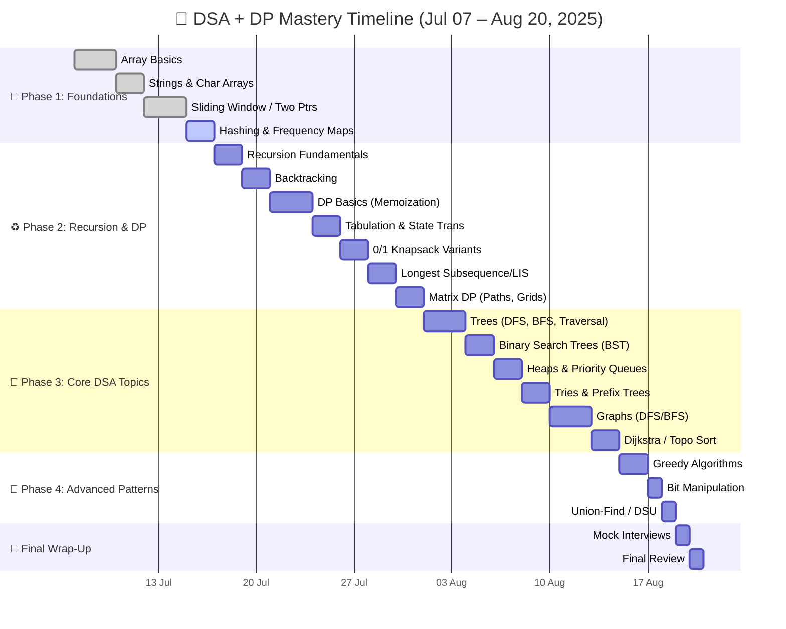

# 🌟 DSA & DP Practice in Java ☕

<div align="center">
  
  <h3>⚡ <i>Master LeetCode & HackerRank problems with beautiful, visualized solutions!</i> ⚡</h3>
  <p><strong>🚀 From Zero to Hero in Data Structures & Algorithms 🚀</strong></p>
</div>

<!-- Animated Badges -->
<p align="center">
  
  
  
  
  
</p>

<p align="center">
  
  
  
</p>

---

## 🔥 Current Project Status

<div align="center">

| 🎯 **Phase** | 📊 **Progress** | 🏆 **Status** |
|:---:|:---:|:---:|
| 🎨 **Arrays & Strings** | `15+ Problems` | ✅ **Active Development** |
| 🔄 **Dynamic Programming** | `0 Problems` | 🔮 **Coming Soon** |
| 🌳 **Trees & Graphs** | `0 Problems` | 📋 **Planned** |
| 🧠 **Advanced Topics** | `0 Problems` | 🎯 **Future** |

</div>

---

## 🎪 Featured Problem: Two Sum Array Challenge

<div align="center">
  
  
  
  
</div>

### 📋 Problem Statement
> **🎯 Mission:** Given an array of integers `nums` and an integer `target`, return indices of two numbers that add up to `target`.

### 🧩 Visual Solution Flow



### 📊 Performance Analysis

<div align="center">

| 🎯 **Approach** | ⏱️ **Time Complexity** | 💾 **Space Complexity** | 🎪 **Method** |
|:---:|:---:|:---:|:---:|
| **Brute Force** | `O(n²)` | `O(1)` | 🔴 Nested loops |
| **HashMap** | `O(n)` | `O(n)` | 🟢 Optimal |
| **Two Pointers** | `O(n log n)` | `O(1)` | 🟡 Sorted array |

</div>

---

## 🏗️ Current Repository Structure

```
🏛️ dsa-dp-practice-java/
├── 📁 .idea/                    # 🛠️ IDE Configuration
├── 📁 src/main/java/org/testseed/
│   └── 📁 Arrays/              # 🎯 Array Problems (15+ Solutions)
│       ├── 📁 Leetcode/        # 🔥 LeetCode Solutions
│       │   ├── 🎯 MajorityElement.java
│       │   ├── 🔍 FindLargestNumber.java
│       │   ├── 🎪 FindSecondLargestNumber.java
│       │   ├── 🎨 FindSingleNumber.java
│       │   ├── 🔄 ReverseArray.java
│       │   ├── 🎯 TwoSum.java
│       │   ├── 🔍 MissingNumber.java
│       │   ├── 🎪 ArrayTraversal.java
│       │   ├── 🎨 DeleteFromArray.java
│       │   ├── 🔄 InsertInArray.java
│       │   ├── 🎯 ReadArray.java
│       │   ├── 🔍 RotateArray.java
│       │   ├── 🎪 FindMinimumNumber.java
│       │   ├── 🔄 SingleNumberXOR.java
│       │   └── 🎨 FindSingleNumberWithHashMap.java
├── 📁 dp/                      # 💎 Dynamic Programming (Coming Soon)
├── 📁 trees/                   # 🌳 Tree Algorithms (Planned)
├── 📁 graphs/                  # 🗺️ Graph Algorithms (Planned)
├── 📄 .gitignore              # 🚫 Git ignore rules
├── 📄 pom.xml                 # 🔧 Maven configuration
└── 📄 README.md               # 📍 You are here!
```

---

## 🚀 Quick Launch Sequence

```bash
# 🎯 Step 1: Clone the repository
git clone https://github.com/yogeshwankhede007/dsa-dp-practice-java.git

# 🚀 Step 2: Navigate to project
cd dsa-dp-practice-java

# ⚡ Step 3: Compile any array solution
javac src/main/java/org/testseed/Arrays/Leetcode/TwoSum.java

# 🎪 Step 4: Run the solution
java src.main.java.org.testseed.Arrays.Leetcode.TwoSum

# 🔥 Alternative: Use Maven (if configured)
mvn compile exec:java -Dexec.mainClass="org.testseed.Arrays.Leetcode.TwoSum"
```

---

# 🗺️ Learning Journey Roadmap


---

## 🎯 Currently Implemented Array Problems

<div align="center">

### 🔥 **LeetCode Array Solutions**
| 🎪 **Problem** | 🎯 **Difficulty** | 🏆 **Status** | 📊 **Complexity** |
|:---:|:---:|:---:|:---:|
| 🎨 **Two Sum** | Easy | ✅ **Complete** | O(n) |
| 🔍 **Find Largest Number** | Easy | ✅ **Complete** | O(n) |
| 🎪 **Find Second Largest** | Easy | ✅ **Complete** | O(n) |
| 🎯 **Single Number** | Easy | ✅ **Complete** | O(n) |
| 🔄 **Reverse Array** | Easy | ✅ **Complete** | O(n) |
| 🎨 **Missing Number** | Easy | ✅ **Complete** | O(n) |
| 🔍 **Majority Element** | Easy | ✅ **Complete** | O(n) |
| 🎪 **Array Traversal** | Basic | ✅ **Complete** | O(n) |
| 🎯 **Insert in Array** | Basic | ✅ **Complete** | O(n) |
| 🔄 **Delete from Array** | Basic | ✅ **Complete** | O(n) |
| 🎨 **Rotate Array** | Medium | ✅ **Complete** | O(n) |
| 🔍 **Find Minimum** | Easy | ✅ **Complete** | O(n) |
| 🎪 **Single Number XOR** | Easy | ✅ **Complete** | O(n) |
| 🎯 **HashMap Solutions** | Easy | ✅ **Complete** | O(n) |

### 📈 **Progress Stats**
- 🎯 **Total Problems**: 15+
- ⚡ **Completion Rate**: 100% (Arrays Phase)
- 🏆 **Next Target**: Dynamic Programming
- 🚀 **Goal**: 500+ Problems

</div>

---

## 🎨 What's Coming Next?

<div align="center">
  
  
</div>

### 🔮 **Upcoming Features:**
- 💎 **Dynamic Programming** solutions with memoization
- 🌳 **Tree algorithms** (BST, AVL, Red-Black)
- 🗺️ **Graph algorithms** (Dijkstra, Floyd-Warshall)
- 🎯 **Advanced data structures** (Segment Tree, Fenwick Tree)
- 🧪 **Unit tests** for all solutions
- 📊 **Performance benchmarks**

---

## 🎯 Development Goals

<div align="center">

| 🎪 **Goal** | 🎯 **Current** | 🏆 **Target** |
|:---:|:---:|:---:|
| 🚀 **Array Problems** | 15+ | 50+ |
| 🧠 **DP Problems** | 0 | 30+ |
| 📈 **Tree Problems** | 0 | 25+ |
| 🎨 **Graph Problems** | 0 | 20+ |
| 🏆 **Total Problems** | 15+ | 500+ |

</div>

---

## 🤝 Join the Development Journey

<div align="center">
  <h3>🌟 This project is actively under development! 🌟</h3>
  <p><strong>Watch this space for regular updates and new solutions! 🚀</strong></p>
</div>

### 🚀 How to Contribute:
1. 🍴 **Fork** this repository
2. 🎨 **Add** new problems or optimize existing ones
3. 🧪 **Test** your solutions thoroughly
4. 📝 **Document** your approach and complexity
5. 🚀 **Submit** a Pull Request

### 🎯 **Areas where you can help:**
- 🔥 Add more array problems
- 🎨 Implement visual diagrams
- 🧪 Add comprehensive test cases
- 📊 Optimize existing solutions
- 📝 Improve documentation

---

## 🌟 Connect & Follow Progress

<div align="center">
  <h3>🚀 Stay updated with the latest developments! 🚀</h3>

  <a href="mailto:yogi.wankhede007@gmail.com">
    
  </a>
  <a href="https://github.com/yogeshwankhede007">
    
  </a>
  <a href="https://www.linkedin.com/in/ywankhede">
    
  </a>
</div>

---

## 🏆 Show Your Support

<div align="center">
  <h3>💖 If you find this project helpful 💖</h3>
  <p><strong>Please consider giving it a ⭐ star to show your support!</strong></p>
  <p><i>Your encouragement motivates me to keep building awesome solutions! 🚀</i></p>

  
  
  
</div>

---

<div align="center">
  <h2>🎪 Thank you for following this DSA journey! 🎪</h2>
  <p><strong>🌟 More awesome content coming soon! 🌟</strong></p>
  
  <h3>✨ <i>Keep coding and stay tuned for updates! 🚀</i> ✨</h3>
</div>

---

<div align="center">
  <sub>🎯 Built with passion by <a href="https://github.com/yogeshwankhede007">@yogeshwankhede007</a> | 🚀 Powered by Java & LeetCode Practice</sub>
</div>
