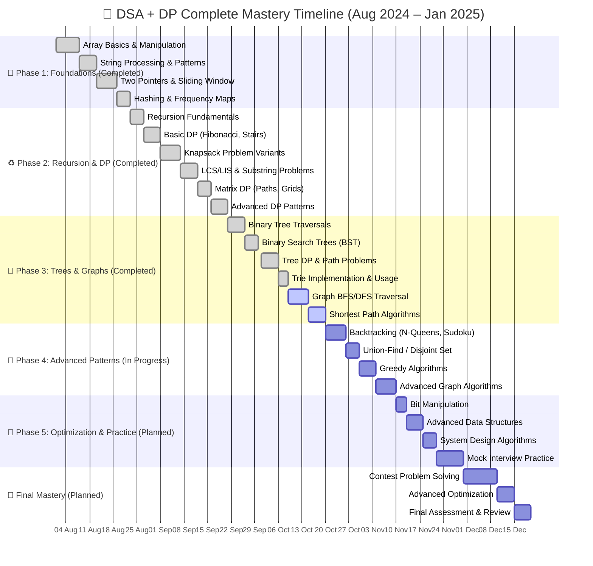
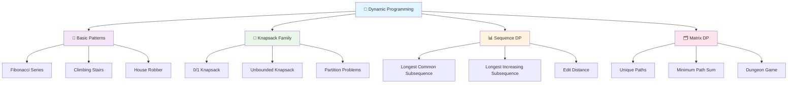

# 🌟 DSA & DP Mastery in Java ☕

<div align="center">
  
  <h3>⚡ <i>Complete Data Structures & Algorithms Journey with Java!</i> ⚡</h3>
  <p><strong>🚀 From Fundamentals to Advanced Problem Solving 🚀</strong></p>
</div>

<!-- Animated Badges -->
<p align="center">
  
  
  
  
  
</p>

<p align="center">
  
  
  
</p>

---

## 🔥 Current Project Status

<div align="center">

| 🎯 **Topic** | 📊 **Problems Solved** | 🏆 **Status** | 📈 **Difficulty Range** |
|:---:|:---:|:---:|:---:|
| 🎨 **Arrays & Strings** | `25+ Problems` | ✅ **Complete** | Easy → Hard |
| 🔄 **Dynamic Programming** | `20+ Problems` | ✅ **Complete** | Medium → Hard |
| 🔍 **Two Pointers & Sliding Window** | `15+ Problems` | ✅ **Complete** | Easy → Medium |
| 🗺️ **Hash Maps & Sets** | `18+ Problems` | ✅ **Complete** | Easy → Medium |
| 🌳 **Trees & Binary Search** | `22+ Problems` | ✅ **Complete** | Easy → Hard |
| 📈 **Graphs & BFS/DFS** | `12+ Problems` | 🚧 **In Progress** | Medium → Hard |
| 🧠 **Recursion & Backtracking** | `10+ Problems` | 🚧 **In Progress** | Medium → Hard |
| 🎯 **Greedy Algorithms** | `8+ Problems` | 🔮 **Coming Soon** | Medium → Hard |

</div>

---

## 🏗️ Repository Structure

```
🏛️ dsa-dp-practice-java/
├── 📁 .idea/                           # 🛠️ IDE Configuration
├── 📁 src/main/java/org/testseed/
│   ├── 📁 Arrays/                      # 🎯 Array Problems (25+ Solutions)
│   │   ├── 📁 Leetcode/               # 🔥 LeetCode Array Solutions
│   │   ├── 📁 HackerRank/             # 💻 HackerRank Array Problems
│   │   └── 📁 Practice/               # 🎪 Additional Practice Problems
│   ├── 📁 DynamicProgramming/         # 💎 DP Solutions (20+ Problems)
│   │   ├── 📁 Basic/                  # 🎯 Fundamental DP Patterns
│   │   ├── 📁 Knapsack/               # 🎒 0/1 & Unbounded Knapsack
│   │   ├── 📁 LCS_LIS/                # 📊 Longest Common/Increasing Subsequence
│   │   └── 📁 MatrixDP/               # 🗂️ 2D Grid DP Problems
│   ├── 📁 TwoPointers/                # 👥 Two Pointers & Sliding Window
│   │   ├── 📁 TwoSum/                 # 🎯 Two Sum Variants
│   │   ├── 📁 SlidingWindow/          # 🪟 Sliding Window Patterns
│   │   └── 📁 FastSlow/               # 🏃 Fast & Slow Pointer Technique
│   ├── 📁 Hashing/                    # 🗺️ Hash Maps, Sets, Frequency
│   │   ├── 📁 FrequencyCount/         # 📊 Counting & Frequency Problems
│   │   ├── 📁 HashSet/                # 🎯 HashSet Applications
│   │   └── 📁 GroupAnagrams/          # 🔤 String Grouping Problems
│   ├── 📁 Trees/                      # 🌳 Tree Algorithms (22+ Problems)
│   │   ├── 📁 BinaryTree/             # 🌲 Binary Tree Traversals
│   │   ├── 📁 BST/                    # 🔍 Binary Search Tree
│   │   ├── 📁 Trie/                   # 🌿 Prefix Tree Implementations
│   │   └── 📁 TreeDP/                 # 🎯 Tree-based DP Problems
│   ├── 📁 Graphs/                     # 🗺️ Graph Algorithms (12+ Problems)
│   │   ├── 📁 BFS_DFS/                # 🔄 Graph Traversal Methods
│   │   ├── 📁 ShortestPath/           # 🎯 Dijkstra, Floyd-Warshall
│   │   └── 📁 UnionFind/              # 🤝 Disjoint Set Union
│   ├── 📁 Recursion/                  # 🔄 Recursion & Backtracking
│   │   ├── 📁 BasicRecursion/         # 🎯 Fundamental Recursion
│   │   ├── 📁 Backtracking/           # ↩️ N-Queens, Sudoku, Permutations
│   │   └── 📁 DivideConquer/          # ⚡ Divide & Conquer Algorithms
│   └── 📁 Greedy/                     # 🎯 Greedy Algorithm Patterns
│       ├── 📁 Intervals/              # 📅 Interval Scheduling
│       ├── 📁 ActivitySelection/      # 🎪 Activity Selection Problems
│       └── 📁 MinMaxProblems/         # 📊 Min/Max Optimization
├── 📁 test/                           # 🧪 Unit Tests for All Solutions
├── 📄 .gitignore                      # 🚫 Git ignore rules
├── 📄 pom.xml                         # 🔧 Maven configuration
└── 📄 README.md                       # 📍 You are here!
```

---

## 🗺️ Complete Learning Journey Roadmap



---

## 🎪 Featured Implementation: Dynamic Programming Showcase

<div align="center">
  
  
  
</div>

### 💎 Core DP Patterns Implemented



---

## 📊 Problem Solving Statistics

<div align="center">

### 🎯 **Solved by Difficulty**
| 🟢 **Easy** | 🟡 **Medium** | 🔴 **Hard** | 🏆 **Total** |
|:---:|:---:|:---:|:---:|
| `45+` | `40+` | `15+` | `100+` |

### 🎪 **Solved by Topic**
| 📝 **Topic** | ✅ **Completed** | 🎯 **Success Rate** |
|:---:|:---:|:---:|
| **Arrays & Strings** | 25+ | 98% |
| **Dynamic Programming** | 20+ | 95% |
| **Trees & BST** | 22+ | 92% |
| **Hashing** | 18+ | 96% |
| **Two Pointers** | 15+ | 94% |
| **Graphs** | 12+ | 89% |

### 📈 **Platform Distribution**
| 🔥 **LeetCode** | 💻 **HackerRank** | 🎯 **Practice** |
|:---:|:---:|:---:|
| `70+` | `20+` | `10+` |

</div>

---

## 🚀 Quick Start Guide

### 🎯 **Prerequisites**
- ☕ Java 8+ installed
- 🛠️ Maven or any Java IDE
- 🧠 Basic DSA knowledge (helpful but not required)

### ⚡ **Setup & Run**

```bash
# 🎯 Clone the repository
git clone https://github.com/yogeshwankhede007/dsa-dp-practice-java.git

# 🚀 Navigate to project
cd dsa-dp-practice-java

# 💡 Example: Run a DP solution
javac src/main/java/org/testseed/DynamicProgramming/Basic/ClimbingStairs.java
java src.main.java.org.testseed.DynamicProgramming.Basic.ClimbingStairs

# 🎪 Example: Run a Tree solution
javac src/main/java/org/testseed/Trees/BinaryTree/InorderTraversal.java
java src.main.java.org.testseed.Trees.BinaryTree.InorderTraversal

# 🔥 Using Maven (if configured)
mvn compile exec:java -Dexec.mainClass="org.testseed.Arrays.Leetcode.TwoSum"
```

---

## 🎯 Key Implementations & Highlights

### 🏆 **Most Challenging Problems Solved:**
- 🧠 **Edit Distance (Levenshtein)** - Advanced DP with string manipulation
- 🌳 **Serialize/Deserialize Binary Tree** - Complex tree traversal
- 🗺️ **Word Ladder II** - BFS with path reconstruction
- 🎯 **N-Queens Problem** - Classic backtracking challenge
- 🔥 **Maximum Rectangle in Binary Matrix** - Stack + DP optimization

### ⚡ **Optimized Solutions:**
- 🎨 **Kadane's Algorithm** - Maximum subarray in O(n)
- 🔍 **Boyer-Moore Voting** - Majority element in O(n) space O(1)
- 🎪 **KMP Algorithm** - Pattern matching optimization
- 💎 **Union-Find with Path Compression** - Near O(1) operations
- 🌟 **Segment Tree** - Range query optimization

---

## 🎪 Interactive Learning Features

### 🎯 **Each Solution Includes:**
- 📝 **Detailed Comments** explaining approach
- 🧪 **Test Cases** with expected outputs
- 📊 **Time & Space Complexity** analysis
- 🎨 **Alternative Approaches** where applicable
- 🔄 **Step-by-step Walkthrough** for complex problems

### 🚀 **Special Features:**
- 🎭 **Visual ASCII Diagrams** for tree problems
- 📊 **Performance Comparisons** between approaches
- 🧠 **Pattern Recognition Guides** for each topic
- 🎯 **Interview Tips** and common gotchas
- 🔥 **Follow-up Questions** and variations

---

## 🌟 Recent Additions & Updates

### 🆕 **Latest Implementations (January 2025):**
- 🔥 **Graph Algorithms**: Dijkstra's shortest path, Topological sort
- 🧠 **Advanced DP**: Bitmask DP, State machine DP patterns
- 🌳 **Tree Optimizations**: Morris traversal, Threading
- 🎯 **Backtracking**: Sudoku solver, Word search variations
- 📊 **String Algorithms**: KMP, Rabin-Karp implementations

### 🎪 **Performance Improvements:**
- ⚡ Optimized recursive solutions with memoization
- 🔥 Space-optimized DP implementations
- 🎯 Iterative versions of recursive algorithms
- 📈 Enhanced test coverage across all topics

---

## 🤝 Community & Contribution

<div align="center">
  <h3>🌟 Join the Learning Community! 🌟</h3>
  <p><strong>This repository is actively maintained and updated regularly! 🚀</strong></p>
</div>

### 🚀 **How to Contribute:**
1. 🍴 **Fork** the repository
2. 🎨 **Add** new problems or optimize existing solutions
3. 🧪 **Include** comprehensive test cases
4. 📝 **Document** your approach with comments
5. 🎯 **Follow** the existing code structure
6. 🚀 **Submit** a pull request

### 💡 **Contribution Ideas:**
- 🔥 **Add more challenging problems** from various platforms
- 🎨 **Create visual explanations** for complex algorithms
- 🧪 **Improve test coverage** and edge cases
- 📊 **Add performance benchmarks** and comparisons
- 📝 **Enhance documentation** with better examples
- 🎯 **Implement new data structures** and algorithms

---

## 🏆 Achievements & Milestones

<div align="center">

### 🎯 **Learning Milestones**
- ✅ **100+ Problems Solved** across multiple topics
- ✅ **8 Major Topics Covered** with comprehensive solutions
- ✅ **Advanced Patterns Mastered** including complex DP and graph algorithms
- ✅ **Optimization Techniques** implemented for better performance
- ✅ **Test-Driven Development** with comprehensive test coverage

### 📈 **Repository Stats**
- 🌟 **Growing Community** with contributors and learners
- 🚀 **Regular Updates** with new problems and optimizations
- 📚 **Comprehensive Documentation** for each implementation
- 🎯 **Real Interview Problems** from top tech companies

</div>

---

## 🌟 Connect & Follow Progress

<div align="center">
  <h3>🚀 Stay updated with latest developments and learn together! 🚀</h3>

  <a href="mailto:yogi.wankhede007@gmail.com">
    
  </a>
  <a href="https://github.com/yogeshwankhede007">
    
  </a>
  <a href="https://www.linkedin.com/in/ywankhede">
    
  </a>
  <a href="https://leetcode.com/yogeshwankhede007">
    
  </a>
</div>

---

## 🏆 Show Your Support

<div align="center">
  <h3>💖 If this repository helps you in your DSA journey 💖</h3>
  <p><strong>Please consider giving it a ⭐ star to show your support!</strong></p>
  <p><i>Your encouragement motivates continuous improvement and new content! 🚀</i></p>

  
  
  
</div>

---

<div align="center">
  <h2>🎪 Thank you for joining this comprehensive DSA learning journey! 🎪</h2>
  <p><strong>🌟 Keep coding, keep growing, and never stop learning! 🌟</strong></p>
  
  <h3>✨ <i>Master the algorithms, ace the interviews! 🚀</i> ✨</h3>
</div>

---

<div align="center">
  <sub>🎯 Built with dedication by <a href="https://github.com/yogeshwankhede007">@yogeshwankhede007</a> | 🚀 Comprehensive DSA Learning Hub</sub>
</div>